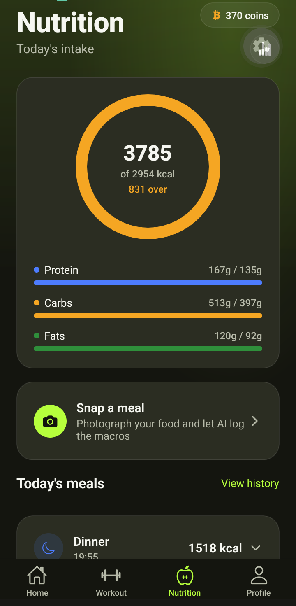

# Golden Health Fitness Center — Web Portal (Showcase)

> **Note:** This is a showcase repository documenting my individual contribution to a team project. 
> The full source code lives in a private team repository; this page summarizes my role, the 
> architecture, and includes screenshots of the features I built.

## Project Overview

A 3-tier digital ecosystem for a fitness center, built by a team of 3 as part of university coursework:
- **Member Portal** (web) — Laravel/PHP, MVC architecture
- **Public-facing Website** — includes membership packages, synced via CMS
- **Mobile App** — React Native (Expo), including AI-powered nutrition tracking

## My Contributions

I owned the following modules end-to-end, from requirements through implementation:

### 🔐 Member Registration & Payments (Web Portal)
- Built the member registration and payments modules using Laravel (MVC)
- Coordinated data and business rules with teammates building the mobile app and public website, so all three platforms stayed consistent

### 🛒 Membership Packages (Public Website)
- Built the packages section of the public-facing website
- Integrated with the gym portal via CMS so package listings and pricing stay in sync across both platforms

### 🍎 AI-Powered Nutrition Tracking (Backend + Mobile)
- Built a Laravel backend (`MealController`, `NutritionController`, `GeminiNutritionService`) integrating the **Gemini AI API** for meal analysis
- Paired with a **React Native (Expo)** mobile UI for logging meals and viewing macro/nutrition insights

## Tech Stack

`Laravel (PHP, MVC)` `React Native (Expo)` `MySQL` `REST APIs` `Gemini AI API` `Blade Templates`

## Screenshots

<!-- Replace these with your actual screenshots. Save images in a /screenshots folder in this repo. -->

### Member Registration

### Payments Flow

### Membership Packages Page

### Nutrition Tracking (Mobile)

## Related Work

Also see my related [E2E automated test suite](link-if-you-make-one) covering authentication, 
registration, and OTP verification flows for this same system (100% pass rate).

---
📫 Questions about this project? Reach me at zahranjpn@gmail.com
